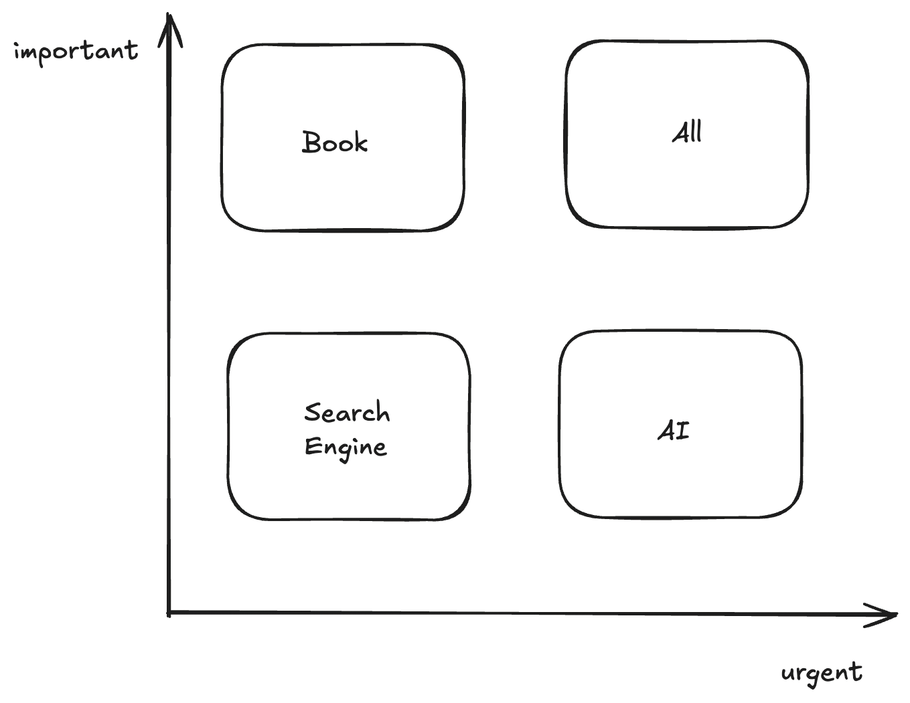

+++
title = "발, 자전거, 자동차\n책, 검색엔진, AI"
date = 2026-09-16
categories = ['ai']
+++

인간은 더 멀리, 더 빠르게, 더 쉽게 목저지에 가고 싶어한다. 그 편리함이 우리를 병들게 한다. 
전신의 움직임을 많이 요구하지 않는 이동수단은 우리를 걷거나 뛰지 않게 만든다. 과거에는 마차와 가마가 있었고 현대에는 자동차가 있다.
자동차는 우리를 병들게 만든다. [비만의 원인](https://en.wikipedia.org/wiki/Obesity_in_the_United_States#Physical_activity_and_transportation)

그러나 소도시와 시골에서 자동차는 필수다. 자가용없이 식료품, 가구, 아이를 이동시키기는 매우 어렵다.
우리를 병들게 하는 자가용은 그곳에 없다. 신도시에 있다. 21세기에 새로 지어지는 계획도시들은 주로 운전자를 위해 만들어진다.
건물 아래에 큰 주차장이 생긴다. 도로는 6차선 혹은 8차선으로 매우 넓다. 건물의 폭도 매우 넓어 작은 구멍가게가 보다 창고형 식료품점이 입점한다.
인도에는 두 가지 부류에 사람이 보행한다. 대중교통을 타러 가는 사람과 자가용이 세워진 주차장으로 가는 사람. 보도블록은 빛이 나고 가로수는 앳되지만
왠지 걷고 싶지는 않다. 이렇게 신도시가 운전자만을 위해 지어지는 이유는 어린이와 청소년들이 돈과 투표권이 없기 때문이다. 자가용이 없는 교통약자는 신도시에서 대중교통을 타고 구도시에서
친구를 만나 거리를 구경한다. 부모 세대가 자동차를 가졌기 때문에 신도시가 새워지고, 자식 세대는 그 신도시에 살아야 하기 때문에 자동차를 사야한다.
그렇게 악순환이 반복된다.

AI도 자동차와 같다. 자동차가 우리를 목적지까지 쉽고 빠르게 데려간다면 AI는 우리를 답까지 쉽고 빠르게 데려간다.
자동차가 고장이 나 사고가 날 수 있는 것 처럼 AI도 스스로 환각을 생성해 틀린 답을 제공할 수 있다.
결정적으로 자동차가 우리에게서 운동시간을 뺏어가듯이 AI는 우리에게서 생각시간을 뺏어간다.
생각시간이 적어질 수록 우리는 스스로 답을 찾는 능력을 잃어간다.

그나마 좋은 점이 하나있다. 아직 우리는 AI 사용자만을 위한 신도시를 세우진 않았다. 세우고 있는 중이다.
자동차가 발명되고 나서 신호등과 표지판이 생겼듯 AI가 발명되고 나서 프롬프트 엔지니어링이나 하네스 엔지니어링이 생겼다.
시간 문제겠지만 멀지 않은 미래에 AI 신도시가 세워질 것이다. 거기선 사람들이 AI에게 판단을 맡기며 살고 있을거다. 자동차에게 자신의 발을 맡기듯이.

자동차를 타지 말자 혹은 AI를 사용하지 말자는 주장을 하고 싶지 않다. 위에서 이미 얘기 했듯이 자동차가 필요한 순간이 반드시 존재한다.
AI가 필요한 순간도 존재한다. 책을 읽거나 직접 검색하며 직접 답을 찾을 시간이 부족할 때가 바로 그 순간이다. 그런 순간이 아주 많이 있을 수 있다.
예를 들어 당신의 상사가 당신의 정신건강은 신경쓰지 않고 그저 일을 최대한 빨리 처리하기를 원할 때다. 마치 운송회사 사장들이 트럭 운전자가 하루에
10시간 이상 운전하는 걸 원하듯이 말이다. 이럴 때 우리는 짬을 내어 운동을 해야 한다. 독서는 정신을 위한 스트레칭이고 글쓰기는 웨이트 트레이닝이다.
(내가 글을 쓰는 이유가 여기에 있다)

검색엔진도 좋은 해결책이다. 자전거는 우리가 몸을 쓰게 만들면서 편리함을 준다.
검색엔진은 우리가 스스로 원자료를 읽고 판단하게 하면서 쉽게 정답을 찾아가도록 한다. (검색엔진 기업이 정상적이라면 그렇다)

마지막으로 여러분에게 하나 바라는 것이 있다. 앞으로 우리는 ai 신도시를 만들지 말자. 그리하여 우리 자식들에게 ai를 의지와 상관없이
사용해야 하는 상황이 오게 하지말자. 소프트웨어 도시를 AI와 검색엔진과 책이 함께 조화롭게 살아가는 공간으로 만들자.

 우리에게 아직 구글 ai 맵이 없다. 그래서 질문의 답을 찾기 위해 책을 읽는 게 좋을 지, 검색을 하는 게 좋을 지, AI를 사용하는 게 좋을 지 알려주지 않는다.
 이럴 때 스스로 판단해보자. 나는 개인적으로 아래 매트릭스에 따라 선택하려고 한다.

